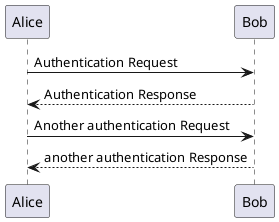

# 模板文件

## 文本高亮

> [!TIP]
> An alert of type 'tip' using global style 'callout'.

> [!NOTE]
> An alert of type 'note' using global style 'callout'.

> [!WARNING]
> An alert of type 'warning' using global style 'callout'.

> [!ATTENTION]
> An alert of type 'attention' using global style 'callout'.

## Section X

## Emoji

https://emojipedia.org/

📚📗📘📙📕📒📔📓📖

🖥️⌨️🖱️📀

😉😝🤪😛😲

🚩🏳️‍🌈🏴‍☠️

💗💙💚💛🧡💜🖤

💯💤🔖🎬

🍉🍋🥭🍊🍅🍒🥦