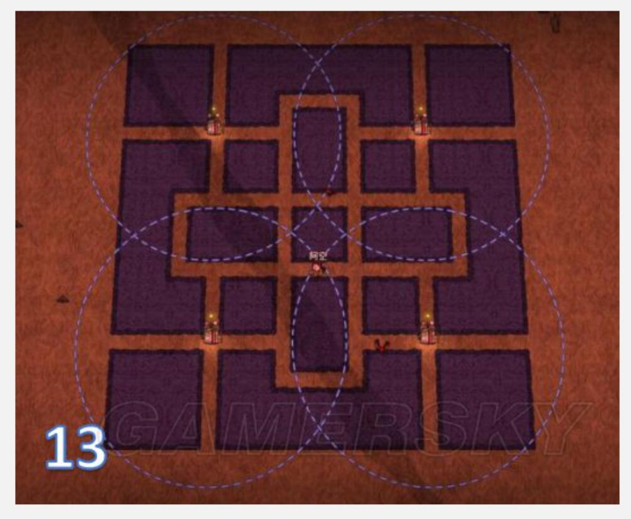

# 饥荒季节攻略

## 全季节

### 制造

- 精炼材料

  > 木板 = 木头×4
  >
  > 石砖 = 石头×3
  >
  > 草绳 = 草×3
  >
  > 莎草纸 = 芦苇×４
  >
  > 电子元件 = 金子 * 2 + 石砖 * 1
  >
  > 紫宝石 = 红宝石 * 1 + 蓝宝石 * 1

- 科技：

  - 海上科技：木板 * 4
  - 一本魔法科技：兔子 * 4 + 木板 * 4 + 高礼帽 * 1
  - 二本魔法科技：活木 * 3 + 紫宝石 * 1 + 噩梦燃料 * 7

- 光源

  - 鼹鼠帽（可选）：鼹鼠 * 1 + 电子元件 * 2 + 发光浆果 * 1
  - 龙鳞火炉（可选）：鳞片 * 1 + 红宝石 * 2 + 木炭 * 10

- 工具

  - 金色工具 ： 树枝 * 4 + 金子 * 2

- 生存：

  - 治疗药膏（+20）：灰烬 * 2 + 石头 * 1 + 蜘蛛腺体 * 1
  - 蜂蜜药膏（+30）：莎草纸 * 1 + 蜂蜜 * 2

- 骑牛

  - 鞍具：牛毛 * 4 + 猪皮 * 4 + 金子 * 4
  - 牛铃：金子 * 3 + 燧石 * 1

- 战斗：

  - 火魔杖（可选）：噩梦燃料 * 2 + 长矛 * 1 + 红宝石
  - 冰魔杖（可选）：长矛 * 1 + 蓝宝石 * 1

- 服装

  - 保鲜背包（可选）：熊皮 * 1 + 齿轮 * 1 + 电子元件 * 1
  - 猪皮背包（12个格子，可选）：猪皮 * 4 + 蜘蛛网 * 6 + 草绳 * 2
  - 高礼帽：蜘蛛网 * 6

- 建筑

  - 龙鳞宝箱（可选）：鳞片 * 1 + 木板 * 4 + 金子 * 10
  - 盐盒：盐晶 * 10 + 蓝宝石 * 1 + 石砖 * 1
  - 猪房：木板 * 4 + 石砖 * 3 + 猪皮 * 4
  - 兔房：木板 * 4 + 胡萝卜 * 10 + 兔毛 * 4

### 食物

- 蔬菜度
  - 1蔬菜度：石果，仙人掌，苔藓，蕨类植物，各类蔬菜（胡萝卜，番茄，土豆，洋葱，大蒜，辣椒，芦笋，南瓜，玉米）
  - 0.5蔬菜度：海带，仙人掌花，各类蘑菇（红蘑菇，绿蘑菇，蓝蘑菇，月亮蘑菇）。
- 肉度
  - 1肉度：大肉，怪物肉，叶肉，象鼻
  - 0.5肉度：小肉，蛙腿，鸡腿，蝙蝠翅膀
- 果度
  - 1果度：石榴，西瓜，火龙果，香蕉，大发光浆果。
  - 0.5果度：浆果，多汁浆果，小发光浆果，无花果。
- 推荐食谱
  - 培根煎蛋：蛋 * 2 + 肉 * 1.5，不能有蔬菜，效果：生命+20，饱食度+75，精神+5
  - 火龙果派：火龙果 * 1，不能有肉，生命+30，饱食度+75，精神+5
  - 蛙腿三明治：蛙腿 * 1 + 蔬菜 * 0.5，生命+20，饱食度+37.5，精神+5
  - 蜜汁火腿：蜂蜜 * 1 + 肉 * 2，不能有树枝，生命+30，饱食度+75，精神+5 
  - 肉丸：肉 * 0.5，不能有树枝，生命+3，饱食度+62.5，精神+5（yyds,只要一块肉，什么都可以加）
  - 炖肉汤：肉 * 3，不能有树枝，生命+12，饱食度+150，精神+5 （肉多可以做）
  - 波兰水饺：蛋 * 1 + 肉 * 0.5 + 蔬菜 * 0.5，生命+40，饱食度+37.5，精神+5（回血神器）
  - 南瓜曲奇：南瓜 * 1 + 蜂蜜 * 2，生命+0，饱食度+37.5，精神+15
  - 太妃糖：蜂蜜 * 3，不能有肉，生命-3，饱食度+25，精神+15
  - 西瓜棒冰：冰 * 1 + 西瓜 * 1 + 树枝 * 1，不能有肉蛋蔬菜，生命-3，饱食度+12.5，精神+20（夏季解暑）
  - 什锦坚果：桦树果 * 1 + 浆果 * 2 + 树枝 * 1，生命+30，饱食度+12.5，精神+5
  - 风干肉：生命+20，饱食度+25，精神+15
  - 蝴蝶松饼：蝴蝶翅膀 * 1 + 蔬菜 * 1 + 树枝 * 2，生命+20，饱食度+37.5，精神+5

## 春季

### 基本

- 时间：15天
- 春天会下雨，过冷‘
- 潮湿
- 青蛙雨
- 闪电

### 物品

- 过夏准备
  - 清凉夏装：草绳 * 1 + 红色羽毛 * 3 + 猪皮 * 2
  - 冰帽：电子元件 * 2 + 草绳 * 4 + 冰块 * 10
  - 雪球发射器：齿轮 * 2 + 冰块 * 15 + 电子元件 * 2
  - 吸热火堆：硝石 * 2 + 石砖 * 4 + 电子元件 * 2
  - 暖石：石头 * 10 + 稿子 * 1 + 燧石 * 3 
  - 遮阳棚：蜘蛛网＊２＋木板 * 4 + 草绳 * 3
- 战斗
  - 养蜂帽（蜂王）：蜘蛛网 * 8 + 草绳 * 1
  - 捕虫网（抓蜜蜂）：树枝 * 3 + 蜘蛛网 * 4
- 建筑
  - 蜂箱：木板 * 2 + 蜂巢 * 1 + 蜜蜂 * 6

### 春天可干的事情

- 种地
- 移植：浆果丛，草，树枝
- 养蜜蜂
- 钓鱼

### BOSS-大鹅

- 准备：
  - 木甲 * 3
  - 猪皮头盔 * 1
  - 肉干 * 10
- 打3走1
- 小鸭子会在大鹅死了之后疯狂，走位躲小鸭子

## 夏季

### 基本

- 时间：15天
- 有狗：火狗（不要在家打）
- 植物会枯萎
- 食人花会收获

### 物品

- 服装
  - 沙漠护目镜（需要图纸）：时髦的护目镜 * 1 + 猪皮 * 1
  - 时髦的护目镜（需要图纸）：金子 * 1 + 猪皮 * 1
- 工具
  - 淡水钓杆：树枝 * 2 + 蜘蛛网 * 2

### 夏天可干的事

- 去地底，探险

### BOSS-蚂狮

- 准备：
  - 去沙漠绿洲钓图纸
- 温蒂刷刷刷

## 秋季

### 基本

- 时间：20天
- 月圆：第9-10天
- 秋季末注意保暖
- 有狗

### 食物来源

- 食物收集

  - 采摘：胡萝卜 + 浆果 + 蘑菇

  - 蜘蛛：怪兽肉

  - 青蛙：蛙腿

  - 高脚鸟：大肉

  - 野猫：大肉

  - 二师兄：大肉
  - 兔子：小肉

### 物品

- 科技：
  - 一本科技：金子 × 1 + 木头 × 4 + 石头 × 4
  - 二本科技：木板 × 4 + 石砖 × 2 + 电子元件 × 2

- 光源：
  - 石头火堆：木头 * 2 + 石头 * 12
  - 矿工帽：草帽 * 1 + 金子 * 1 + 萤火虫 * 1
  - 提灯：树枝 * 3 + 草绳 * 2 + 荧光果 * 2
- 战斗：
  - 长矛：树枝 * 2 + 草绳 * 1 + 燧石 * 1
  - 火腿棒：猪皮 * 1 + 树枝 * 2 + 大肉 * 2
  - 木甲：木头 * 8 + 草绳 * 2
  - 橄榄球头盔：猪皮 * 1 + 草绳 * 1
- 工具：
  - 普通工具（斧头稿子等）：树枝 * 2 + 燧石 * 2
  - 锤子：树枝 * 3 + 石头 * 3 + 草绳 * 2
  - 捕虫网（8次）：树枝 * 3 + 蜘蛛网 * 4
  - 捕鸟陷阱：树枝 * 4 + 蜘蛛网 * 2 + 草绳 * 1
  - 耕地机：木板 * 3 + 草绳 * 2 + 燧石 * 2
- 服装：
  - 花环：花瓣 * 12
  - 草帽：草 * 12
  - 背包：草 * 4 + 树枝 * 4
- 建筑：
  - 帐篷：蜘蛛网 * 6 + 树枝 * ４＋草绳 * 3
  - 箱子：木板 * 3
  - 冰箱：金子 * 2 + 齿轮 * 1 + 石砖 * 1
  - 烹饪锅：石砖 * 3 + 木炭 * 6 + 树枝 * 6
  - 晾肉架：树枝 * 3 + 木炭 * 2 + 草绳 * 3
  - 姐妹骨灰盒：石砖 * 3 + 木板 * 3 + 灰烬 * 1
  - 木牌：木板 * 1
  - 鸟笼：莎草纸 * 2 + 金子 * 6 + 种子 * 2
- 过冬准备
  - 暖石：石头 * 10 + 稿子 * 1 + 燧石 * 3 
  - 冬帽：牛毛 * 4 + 蜘蛛网 * 4
  - 牛角帽：牛毛 * 8 + 牛角 * 1
  - 针线包：木头 * 1 + 蜘蛛网 * 8 +  犬牙 * 2
- 材料总结：
  - 草：80+
  - 树枝：120+
  - 木头：120+
  - 燧石：40+
  - 石头：100+
  - 金子：20+
  - 蜘蛛网：28+
  - 齿轮：3+
  - 荧光果：10+
  - 萤火虫：2
  - 花瓣：24+
  - 猪皮：4+
  - 牛毛：16
  - 牛角：2
  - 芦苇：8
  - 种子：++
  - 犬牙：2+

### 秋季可干的事

秋季是开始的季节，发育为主

- 探图第一，找到牛群，猪王，海象营地，蜂后，龙蝇，地洞

- 收集资源第二

- 给牛剃毛

- 建家

  

- 准备好过冬的材料

### BOSS-熊大

第二年开始秋季才有BOSS

- 

## 冬季

### 基本

- 时间：15天
- 有狗：冰狗

### 物品

- 过春准备
  - 避雷针：金子 * 4 + 石砖 * 1
  - 雨伞：树枝 * 6 + 猪皮 * 1 + 蜘蛛网 * 2
  - 花伞：树枝 * 4 + 草 * 3 + 花瓣 * 6
  - 雨帽（可选）：鼹鼠 * 2 + 草帽 * 1 + 骨头碎片 * 1
  - 雨衣（可选）：触手皮 * 2 + 草绳 * 2 + 骨头碎片 * 2
  - 眼球伞（可选）：眼球 * 1 + 树枝 * 15 + 骨头碎片 * 4
- 过夏准备
  - 雪球制造机：齿轮 * 2 + 冰块 * 15 + 电子元件 * 2
- 工具
  - 步行手杖：金子 * 2 + 海象牙 * 1 + 树枝 * 4
- 材料总结
  - 树枝：35+
  - 草：10+
  - 木头：10+
  - 冰块：60+
  - 骨头碎片：8+
  - 鼹鼠：4+
  - 海象牙：2+

### 冬季可干的事情

- 刷海象牙，海象帽
- 杀冬象
- 打boss
- 凿冰块

### BOSS-巨鹿

- 准备
  - 木甲 * 3
  - 猪皮头盔 * 1
  - 火腿棒 * 1 
  - 肉干 * 10
- 不要在家里打，boss对建筑有仇恨
- 打2走1，它攻击了3次之后会震地板，震地板之后上去打1下就走，然后再打2走1循环