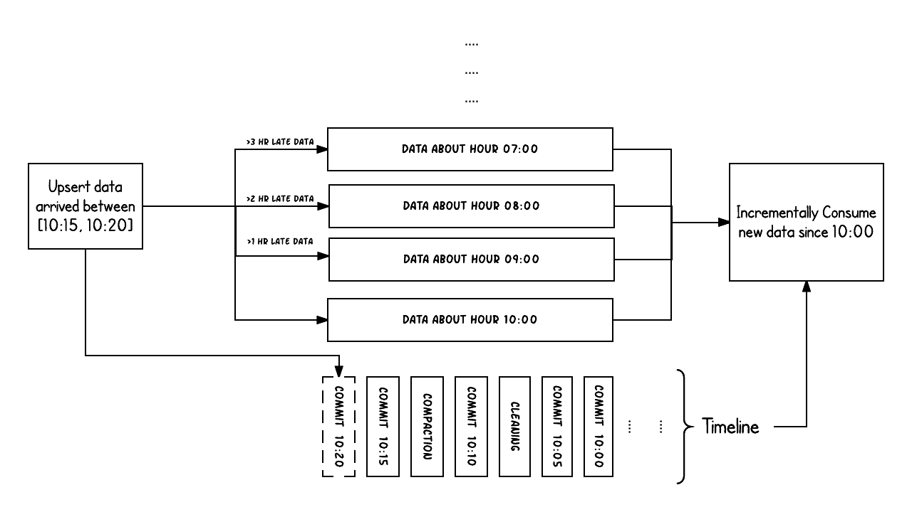

# Hudi基本概念

## 发展历史

2015 年：发表了增量处理的核心思想/原则（O'reilly 文章）。

2016 年：由 Uber 创建并为所有数据库/关键业务提供支持。

2017 年：由 Uber 开源，并支撑 100PB 数据湖。

2018 年：吸引大量使用者，并因云计算普及。

2019 年：成为 ASF 孵化项目，并增加更多平台组件。

2020 年：毕业成为 Apache 顶级项目，社区、下载量、采用率增长超过 10 倍。

2021 年：支持 Uber 500PB 数据湖，SQL DML、Flink 集成、索引、元服务器、缓存。

## Hudi特性

1）可插拔索引机制支持快速Upsert/Delete。

2）支持增量拉取表变更以进行处理。

3）支持事务提交及回滚，并发控制。

4）支持Spark、Presto、Trino、Hive、Flink等引擎的SQL读写。

5）自动管理小文件，数据聚簇，压缩，清理。

6）流式摄入，内置CDC源和工具。

7）内置可扩展存储访问的元数据跟踪。

8）向后兼容的方式实现表结构变更的支持

## 使用场景

1）近实时写入

- 减少碎片化工具的使用。

- CDC 增量导入 RDBMS 数据。
- 限制小文件的大小和数量。

2）近实时分析

-  相对于秒级存储（Druid, OpenTSDB），节省资源。

-  提供分钟级别时效性，支撑更高效的查询。

-  Hudi作为lib，非常轻量。

3）增量 pipeline

-  区分arrivetime和event time处理延迟数据。

-  更短的调度interval减少端到端延迟（小时 -> 分钟） => Incremental Processing。

4）增量导出

-  替代部分Kafka的场景，数据导出到在线服务存储 e.g. ES。

## 核心概念

### 基本概念

#### 时间轴-TimeLine

Hudi的核心是维护表上在不同的即时时间（instants）执行的所有操作的时间轴（timeline），这有助于提供表的即时视图，同时还有效地支持按到达顺序检索数据。一个instant由以下三个部分组成：

1）Instant action：在表上执行的操作类型

**COMMITS**：一次commit表示将一批数据原子性地写入一个表。

**CLEANS**：清除表中不再需要的旧版本文件的后台活动。

**DELTA_COMMIT**：增量提交指的是将一批数据原子性地写入一个MOR类型的表，其中部分或所有数据可以写入增量日志。

**COMPACTION**：合并Hudi内部差异数据结构的后台活动，例如:将更新操作从基于行的log日志文件合并到列式存储的数据文件。在内部，COMPACTION体现为timeline上的特殊提交。

**ROLLBACK**：表示当commit/delta_commit不成功时进行回滚，其会删除在写入过程中产生的部分文件。

**SAVEPOINT**：将某些文件组标记为已保存，以便其不会被删除。在发生灾难需要恢复数据的情况下，它有助于将数据集还原到时间轴上的某个点。

2）Instant time

通常是一个时间戳（例如：20190117010349），它按照动作开始时间的顺序单调增加。

3）State
**REQUESTED**：表示某个action已经调度，但尚未执行。
**INFLIGHT**：表示action当前正在执行。
**COMPLETED**：表示timeline上的action已经完成。

4）两个时间概念

区分两个重要的时间概念：

**Arrival time**: 数据到达 Hudi 的时间，commit time。

**Event time**: record 中记录的时间。

#### 文件布局-File Layout

#### 索引-Index

#### 表类型-Table Type

#### 查询类型-Query Types

### 数据写

### 数据读
!> 提示信息

