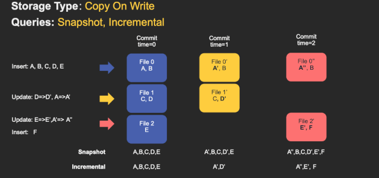

# Hudi基本概念

> [!tip] 参考官网文档：https://hudi.apache.org/docs/overview

## 发展历史

2015 年：发表了增量处理的核心思想/原则（O'reilly 文章）。

2016 年：由 Uber 创建并为所有数据库/关键业务提供支持。

2017 年：由 Uber 开源，并支撑 100PB 数据湖。

2018 年：吸引大量使用者，并因云计算普及。

2019 年：成为 ASF 孵化项目，并增加更多平台组件。

2020 年：毕业成为 Apache 顶级项目，社区、下载量、采用率增长超过 10 倍。

2021 年：支持 Uber 500PB 数据湖，SQL DML、Flink 集成、索引、元服务器、缓存。

## Hudi特性

1）可插拔索引机制支持快速Upsert/Delete。

2）支持增量拉取表变更以进行处理。

3）支持事务提交及回滚，并发控制。

4）支持Spark、Presto、Trino、Hive、Flink等引擎的SQL读写。

5）自动管理小文件，数据聚簇，压缩，清理。

6）流式摄入，内置CDC源和工具。

7）内置可扩展存储访问的元数据跟踪。

8）向后兼容的方式实现表结构变更的支持

## 使用场景

1）近实时写入

- 减少碎片化工具的使用。

- CDC 增量导入 RDBMS 数据。
- 限制小文件的大小和数量。

2）近实时分析

-  相对于秒级存储（Druid, OpenTSDB），节省资源。

-  提供分钟级别时效性，支撑更高效的查询。

-  Hudi作为lib，非常轻量。

3）增量 pipeline

-  区分arrivetime和event time处理延迟数据。

-  更短的调度interval减少端到端延迟（小时 -> 分钟） => Incremental Processing。

4）增量导出

-  替代部分Kafka的场景，数据导出到在线服务存储 e.g. ES。

## 核心概念

### 基本概念

#### 时间轴-TimeLine

> [!NOTE] Hudi的核心是维护表上在不同的即时时间（instants）执行的所有操作的时间轴（timeline），这有助于提供表的即时视图，同时还有效地支持按到达顺序检索数据。

一个instant由以下三个部分组成：

1）Instant action：在表上执行的操作类型

**COMMITS**：一次commit表示将一批数据原子性地写入一个表。

**CLEANS**：清除表中不再需要的旧版本文件的后台活动。

**DELTA_COMMIT**：增量提交指的是将一批数据原子性地写入一个MOR类型的表，其中部分或所有数据可以写入增量日志。

**COMPACTION**：合并Hudi内部差异数据结构的后台活动，例如:将更新操作从基于行的log日志文件合并到列式存储的数据文件。在内部，COMPACTION体现为timeline上的特殊提交。

**ROLLBACK**：表示当commit/delta_commit不成功时进行回滚，其会删除在写入过程中产生的部分文件。

**SAVEPOINT**：将某些文件组标记为已保存，以便其不会被删除。在发生灾难需要恢复数据的情况下，它有助于将数据集还原到时间轴上的某个点。

2）Instant time

通常是一个时间戳（例如：20190117010349），它按照动作开始时间的顺序单调增加。

3）State
**REQUESTED**：表示某个action已经调度，但尚未执行。
**INFLIGHT**：表示action当前正在执行。
**COMPLETED**：表示timeline上的action已经完成。

4）两个时间概念

区分两个重要的时间概念：

**Arrival time**: 数据到达 Hudi 的时间，commit time。

**Event time**: record 中记录的时间。

> [!NOTE] 上图中采用时间（小时）作为分区字段，分别有7:00，8:00，9:00，10:00等多个分区
>
> 从 10:00 开始陆续产生各种 commits
>
> 如果10:20 来了3条7:00的数据，2条8:00的数据，1条 9:00 的数据，根据event time该数据仍然可以落到对应的分区
>
> 通过 timeline 直接消费 10:00 （commit time）之后的增量更新，那么这些延迟的数据仍然可以被消费到。

#### 文件布局-File Layout

Hudi将一个表映射为如下文件结构：

**Hudi存储分为两个部分**：

（1）元数据：.hoodie目录对应着表的元数据信息，包括表的版本管理（Timeline）、归档目录（存放过时的instant也就是版本），一个instant记录了一次提交（commit）的行为、时间戳和状态，Hudi以时间轴的形式维护了在数据集上执行的所有操作的元数据

（2）数据：和hive一样，以分区方式存放数据，分区里面存放着Base File（.parquet）和Log File（.log.*）

**Hudi的文件管理**：

（1）Hudi将数据表组织成分布式文件系统基本路径（basepath）下的目录结构

（2）表被划分为多个分区，这些分区是包含该分区的数据文件的文件夹，非常类似于Hive表

（3）在每个分区中，文件被组织成文件组，由文件ID唯一标识

（4）每个文件组包含几个文件片（FileSlice）

（5）每个文件片包含：

-  一个基本文件(.parquet)：在某个commit/compaction即时时间（instant time）生成的（MOR可能没有）

-  多个日志文件(.log.*)，这些日志文件包含自生成基本文件以来对基本文件的插入/更新（COW没有）

> [!TIP] base文件就是parquet文件
>
> base文件的命名：\<fileId>\_\<writeToken>\_\<instant>.\<fileExtension>
>
> log文件的命名：.\<fileId>\_\<instant>.\<fileExtension>.\<version>_\<writeToken>
>
> writeToken：\<taskPartitionId>\-\<stageId>\-\<taskAttemptId>

文件组的布局：

> [!NOTE] 如上图，一个文件组（FileGroup）下有多个文件片（FileSlice），一个文件片包含多个base文件（parquet）和若干个log文件（MOR表才有）

（6）Hudi采用了多版本并发控制(Multiversion Concurrency Control, MVCC)

-  compaction操作：合并日志和基本文件以产生新的文件片
-  clean操作：清除不使用的/旧的文件片以回收文件系统上的空间

> [!NOTE]
>
> -  Upsert操作开始，数据被划分为Insert和Updates两类数据
>
> - 10:10Commit提交
> - 文件组有fileid1,fileid2,fileid3,fileid4  每个组下分Base Files和Log File
>
> - 标红的是10:00更新的，只在fileid2和fileid4下有更新
>
> - 表绿的是10:05分更新的，在时间轴上的也是10:05
>
> - 右侧分别是两种读取方式：
>
>   - 读优化查询，只读取了parquet文件
>   - 近事实查询，合并了log文件

（7）Hudi的base file（parquet 文件）在 footer 的 meta 去记录了 record key 组成的 BloomFilter，用于在 file based index 的实现中实现高效率的 key contains 检测。只有不在 BloomFilter 的 key 才需要扫描整个文件消灭假阳。

> [!TIP] "假阳性"（False Positive）是一个统计学和机器学习领域的术语，用于描述在二分类问题中，被错误地判断为正例的负例样本。换句话说，假阳性是指被错误地认为是真实情况的情况，但实际上是错误的。

（8）Hudi 的 log （avro 文件）是自己编码的，通过积攒数据 buffer 以 LogBlock 为单位写出，每个 LogBlock 包含 magic number、size、content、footer 等信息，用于数据读、校验和过滤。

> [!NOTE] 
>
> 分别是hudi组织下的parquet文件和log文件格式

#### 索引-Index

1）原理

Hudi通过索引机制提供高效的upserts，具体是将给定的hoodie key(record key + partition path)与文件id（文件组）建立唯一映射。这种映射关系，数据第一次写入文件后保持不变，所以，一个 FileGroup 包含了一批 record 的所有版本记录。**Index 用于区分消息是 INSERT 还是 UPDATE**。

Hudi 为了消除不必要的读写，引入了索引的实现。在有了索引之后，更新的数据可以快速被定位到对应的 File Group。

> [!NOTE]
>
> 上图为例，白色是基本文件，黄色是更新数据，有了索引机制，可以做到：
>
> 避免读取不需要的文件、避免更新不必要的文件、无需将更新数据与历史数据做分布式关联，只需要在 File Group 内做合并。

2）索引选项

| Index类型                | 原理                                                         | 优点                                                      | 缺点                                   |
| ------------------------ | ------------------------------------------------------------ | --------------------------------------------------------- | -------------------------------------- |
| Bloom  Index             | 默认配置，使用布隆过滤器来判断记录存在与否，也可选使用record key的范围裁剪需要的文件 | 效率高，不依赖外部系统，数据和索引保持一致性              | 因假阳性问题，还需回溯原文件再查找一遍 |
| Simple  Index            | 把update/delete操作的新数据和老数据进行join                  | 实现最简单，无需额外的资源                                | 性能比较差                             |
| HBase  Index             | 把index存放在HBase里面。在插入 File Group定位阶段所有task向HBase发送 Batch Get 请求，获取 Record Key 的 Mapping 信息 | 对于小批次的keys，查询效率高                              | 需要外部的系统，增加了运维压力         |
| Flink  State-based Index | HUDI  在 0.8.0 版本中实现的 Flink witer，采用了 Flink 的 state 作为底层的 index 存储，每个 records 在写入之前都会先计算目标 bucket ID。 | 不同于 BloomFilter Index，避免了每次重复的文件 index 查找 |                                        |

> [!attention] Flink只有一种state based index（和bucket_index），其他index是Spark可选配置。

3）全局索引与非全局索引

**全局索引**：全局索引在全表的所有分区范围下强制要求键的唯一性，也就是确保对给定的键有且只有一个对应的记录。全局索引提供了更强的保证，但是随着表增大，update/delete 操作损失的性能越高，因此更适用于小表。

**非全局索引**：默认的索引实现，只能保证数据在分区的唯一性。非全局索引依靠写入器为同一个记录的update/delete提供一致的分区路径，同时大幅提高了效率，更适用于大表。

从index的维护成本和写入性能的角度考虑，维护一个global index的难度更大，对写入性能的影响也更大，所以需要non-global index。

HBase索引本质上是一个全局索引，bloom和simple index都有全局选项：

-  hoodie.index.type=GLOBAL_BLOOM

-  hoodie.index.type=GLOBAL_SIMPLE

4）索引的选择策略

（1）对事实表的延迟更新

许多公司会在NoSQL数据存储中存放大量的交易数据。

例如共享出行的行程表、股票买卖记录的表、和电商的订单表。

这些表通常一直在增长，且大部分的**更新随机发生在较新的记录上**，而对旧记录有着长尾分布型的更新。

这通常是源于交易关闭或者数据更正的延迟性。换句话说，**大部分更新会发生在最新的几个分区上而小部分会在旧的分区**。

对于这样的作业模式，布隆索引就能表现地很好，因为查询索引可以靠设置得当的布隆过滤器来裁剪很多数据文件。

另外，如果生成的键可以以某种顺序排列，参与比较的文件数会进一步通过范围裁剪而减少。

Hudi用所有文件的键域来构造区间树，这样能来高效地依据输入的更删记录的键域来排除不匹配的文件。

为了高效地把记录键和布隆过滤器进行比对，即尽量减少过滤器的读取和均衡执行器间的工作量，Hudi缓存了输入记录并使用了自定义分区器和统计规律来解决数据的偏斜。

有时，如果布隆过滤器的假阳性率过高，查询会增加数据的打乱操作。

Hudi支持动态布隆过滤器（设置hoodie.bloom.index.filter.type=DYNAMIC_V0）。

它可以根据文件里存放的记录数量来调整大小从而达到设定的假阳性率。

hudi使用布隆过滤器写入：

（2）对事件表的去重

事件流无处不在。

从Apache Kafka或其他类似的消息总线发出的事件数通常是事实表大小的10-100倍。

事件通常把时间（**到达时间、处理时间**）作为首类处理对象，比如物联网的事件流、点击流数据、广告曝光数等等。

由于这些大部分都是仅追加的数据，**插入和更新只存在于最新的几个分区中**。

由于重复事件可能发生在整个数据管道的任一节点，在存放到数据湖前去重是一个常见的需求。

总的来说，低消耗去重是一个非常有挑战的工作。

虽然可以用一个键值存储来实现去重（即HBase索引），但索引存储的消耗会随着事件数增长而线性增长以至于变得不可行。

事实上，**有范围裁剪功能的布隆索引**是最佳的解决方案。

我们可以利用作为首类处理对象的时间来构造由事件时间戳和事件id（event_ts+event_id)组成的键，这样插入的记录就有了单调增长的键。这会在最新的几个分区里大幅提高裁剪文件的效益。

hudi使用布隆过滤器（裁剪）写入：

（3）对维度表的随机更删

正如之前提到的，**如果范围比较不能裁剪许多文件的话**，那么布隆索引并不能带来很好的效益。

在这样一个随机写入的作业场景下，更新操作通常会触及表里大多数文件从而导致布隆过滤器依据输入的更新对所有文件标明阳性。

最终会导致，即使采用了范围比较，也还是检查了所有文件。使用**简单索引对此场景更合适**，因为它不采用提前的裁剪操作，而是直接和所有文件的所需字段连接。如果额外的运维成本可以接受的话，也可以采用HBase索引，其对这些表能提供更加优越的查询效率。

当使用全局索引时，也可以考虑通过设置hoodie.bloom.index.update.partition.path=true或hoodie.simple.index.update.partition.path=true来处理 的情况；

例如对于以所在城市分区的用户表，会有用户迁至另一座城市的情况。

> [!tip] 将 `hoodie.bloom.index.update.partition.path` 设置为 `true` 表示在更新布隆过滤器索引时考虑分区路径，而将其设置为 `false` 表示不考虑分区路径。

这些表也非常适合采用Merge-On-Read表型：

#### 表类型-Table Type

1）**Copy On Write**

在COW表中，**只有数据文件/基本文件**（.parquet）,没有增量日志文件（.log.*）。

对每一个新批次写入都将创建相应数据文件的新版本（新的FileSlice），新版本文件包括旧版本文件的记录以及来自传入批次的记录（全量最新）。

假设我们有 3 个文件组，其中包含如下数据文件。

我们进行一批新的写入，在索引后，我们发现这些记录与File group 1 和File group 2 匹配，然后有新的插入，我们将为其创建一个新的文件组（File group 4）。

> [!note] 
>
> data_file1 和 data_file2 都将创建更新的版本，data_file1 V2 是data_file1 V1 的内容与data_file1 中传入批次匹配记录的记录合并。
>
> 由于在写入期间进行合并，COW 会产生一些写入延迟。但是COW 的优势在于它的简单性，不需要其他表服务（如压缩），也相对容易调试。

2）**Merge On Read**

MOR表中，包含列存的**基本文件**（.parquet）和**行存的增量日志文件**（基于行的avro格式，.log.*）。

顾名思义，MOR表的合并成本在读取端。因此在写入期间我们不会合并或创建较新的数据文件版本。标记/索引完成后，对于具有要更新记录的现有数据文件，Hudi 创建增量日志文件并适当命名它们，以便它们都属于一个文件组。

读取端将实时合并基本文件及其各自的增量日志文件。每次的读取延迟都比较高（因为查询时进行合并），所以 Hudi 使用压缩机制来将数据文件和日志文件合并在一起并创建更新版本的数据文件。

用户可以选择内联或异步模式运行压缩。

Hudi也提供了不同的压缩策略供用户选择，最常用的一种是基于提交的数量。

例如可以将压缩的最大增量日志配置为 4。这意味着在进行 4 次增量写入后，将对数据文件进行压缩并创建更新版本的数据文件。压缩完成后，读取端只需要读取最新的数据文件，而不必关心旧版本文件。

MOR表的写入行为，依据 index 的不同会有细微的差别：

对于 BloomFilter 这种无法对 log file 生成 index 的索引方案，对于 INSERT 消息仍然会写 base file （parquet format），只有 UPDATE 消息会 append log 文件（因为 base file 已经记录了该 UPDATE 消息的 FileGroup ID）。

对于可以对 log file 生成 index 的索引方案，例如 Flink writer 中基于 state 的索引，每次写入都是 log format，并且会不断追加和 roll over。

3）**COW与MOR的对比**

|                      | **CopyOnWrite**           | **MergeOnRead**      |
| -------------------- | ------------------------- | -------------------- |
| 数据延迟             | 高                        | 低                   |
| 查询延迟             | 低                        | 高                   |
| Update(I/O) 更新成本 | 高（重写整个Parquet文件） | 低（追加到增量日志） |
| Parquet文件大小      | 低（更新成本I/O高）       | 较大（低更新成本）   |
| 写放大               | 大                        | 低（取决于压缩策略） |

#### 查询类型-Query Types

Hudi支持如下三种查询类型：

1）**Snapshot Queries**

**快照查询**，可以查询指定commit/delta commit即时操作后表的最新快照。

在读时合并（MOR）表的情况下，它通过即时合并最新文件片的基本文件和增量文件来提供近实时表（几分钟）。

对于写时复制（COW），它可以替代现有的parquet表（或相同基本文件类型的表），同时提供upsert/delete和其他写入方面的功能，可以理解为查询最新版本的Parquet数据文件。

下图是COW的快照查询：

2）**Incremental Queries**

**增量查询**，可以查询给定commit/delta commit即时操作以来新写入的数据。有效的提供变更流来启用增量数据管道。

3）**Read Optimized Queries**

**读优化查询**，可查看给定的commit/compact即时操作的表的最新快照。仅将最新文件片的基本/列文件暴露给查询，并保证与非Hudi表相同的列查询性能。

下图是MOR表的快照查询与读优化查询的对比：

Read Optimized Queries是对Merge On Read表类型快照查询的优化。

|          | **Snapshot**                            | **Read Optimized**   |
| -------- | --------------------------------------- | -------------------- |
| 数据延迟 | 低                                      | 高                   |
| 查询延迟 | 高（合并列式基础文件+行式增量日志文件） | 低(原始列式基础文件) |

4）**不同表支持的查询类型**

| Table Type    | Supported Query Types                                        |
| ------------- | ------------------------------------------------------------ |
| Copy On Write | Snapshort Queries + Incremental Queries                      |
| Merge On Read | Snapshort Queries + Incremental Queries + Read Optimized Queries |

> [!tip] COW表数据插入和更新，快照查询和增量查询

> [!tip] MOR表数据插入和更新，快照查询，增量查询，读优化查询

### 数据写

#### 写操作

（1）**UPSERT**：默认行为，数据先通过 index 打标(INSERT/UPDATE)，有一些启发式算法决定消息的组织以优化文件的大小 => CDC 导入

（2）**INSERT**：跳过 index，写入效率更高 => Log Deduplication

（3）**BULK_INSERT**：写排序，对大数据量的 Hudi 表初始化友好，对文件大小的限制 best effort（写 HFile）

#### 写流程（UPSERT）

1）**Copy On Write**

（1）先对 records 按照 record key 去重

（2）首先对这批数据创建索引 (HoodieKey => HoodieRecordLocation)；通过索引区分哪些 records 是 update，哪些 records 是 insert（key 第一次写入）

（3）对于 update 消息，会直接找到对应 key 所在的最新 FileSlice 的 base 文件，并做 merge 后写新的 base file (新的 FileSlice)

（4）对于 insert 消息，会扫描当前 partition 的所有 SmallFile（小于一定大小的 base file），然后 merge 写新的 FileSlice；如果没有 SmallFile，直接写新的 FileGroup + FileSlice

2）**Merge On Read**

（1）先对 records 按照 record key 去重（可选）

（2）首先对这批数据创建索引 (HoodieKey => HoodieRecordLocation)；通过索引区分哪些 records 是 update，哪些 records 是 insert（key 第一次写入）

（3）如果是 insert 消息，如果 log file 不可建索引（默认），会尝试 merge 分区内最小的 base file （不包含 log file 的 FileSlice），生成新的 FileSlice；如果没有 base file 就新写一个 FileGroup + FileSlice + base file；如果 log file 可建索引，尝试 append 小的 log file，如果没有就新写一个 FileGroup + FileSlice + base file

（4）如果是 update 消息，写对应的 file group + file slice，直接 append 最新的 log file（如果碰巧是当前最小的小文件，会 merge base file，生成新的 file slice）

（5）log file 大小达到阈值会 roll over 一个新的

#### 写流程（INSERT）

1）**Copy On Write**

（1）先对 records 按照 record key 去重（可选）

（2）不会创建 Index

（3）如果有小的 base file 文件，merge base file，生成新的 FileSlice + base file，否则直接写新的 FileSlice + base file

2）**Merge On Read**

（1）先对 records 按照 record key 去重（可选）

（2）不会创建 Index

（3）如果 log file 可索引，并且有小的 FileSlice，尝试追加或写最新的 log file；如果 log file 不可索引，写一个新的 FileSlice + base file

#### 写流程（INSERT OVERWRITE）

在同一分区中创建新的文件组集。现有的文件组被标记为 "删除"。根据新记录的数量创建新的文件组

1）**COW**

| **在插入分区之前**                             | **插入相同数量的记录覆盖**                                   | **插入覆盖更多的记录**                                       | **插入重写1****条记录**                                      |
| ---------------------------------------------- | ------------------------------------------------------------ | ------------------------------------------------------------ | ------------------------------------------------------------ |
| 分区包含  file1-t0.parquet，file2-t0.parquet。 | 分区将添加file3-t1.parquet，file4-t1.parquet。file1, file2在t1后的元数据中被标记为无效。 | 分区将添加  file3-t1.parquet，  file4-t1.parquet，  file5-t1.parquet，  ...，  fileN-t1.parquet。  file1,  file2在t1后的元数据中被标记为无效 | 分区将添加file3-t1.parquet。file1, file2在t1后的元数据中被标记为无效。 |

2）**MOR**

| **在插入分区之前**                                           | **插入相同数量的记录覆盖**                                   | **插入覆盖更多的记录**                                       | **插入重写1****条记录**                                      |
| ------------------------------------------------------------ | ------------------------------------------------------------ | ------------------------------------------------------------ | ------------------------------------------------------------ |
| 分区包含  file1-t0.parquet，  file2-t0.parquet。  .file1-t00.log | file3-t1.parquet，  file4-t1.parquet。  file1,  file2在t1后的元数据中被标记为无效。 | file3-t1.parquet,    file4-t1.parquet  ...  fileN-t1.parquet  file1,  file2在t1后的元数据中被标记为无效 | 分区将添加file3-t1.parquet。file1, file2在t1后的元数据中被标记为无效。 |

3）**优点**

（1）COW和MOR在执行方面非常相似。不干扰MOR的compaction。

（2）减少parquet文件大小。

（3）不需要更新关键路径中的外部索引。索引实现可以检查文件组是否无效（类似于在HBaseIndex中检查commit是否无效的方式）。

（4）可以扩展清理策略，在一定的时间窗口后删除旧文件组。

4）**缺点**

（1）需要转发以前提交的元数据。

在t1，比如file1被标记为无效，我们在t1.commit中存储 "invalidFiles=file1"(或者在MOR中存储deltacommit)

在t2，比如file2也被标记为无效。我们转发之前的文件，并在t2.commit中标记 "invalidFiles=file1, file2"（或MOR的deltacommit）

（2）忽略磁盘中存在的parquet文件也是Hudi的一个新行为, 可能容易出错,我们必须认识到新的行为，并更新文件系统的所有视图来忽略它们。这一点可能会在实现其他功能时造成问题。

#### Key 生成策略

用来生成 HoodieKey（record key + partition path），目前支持以下策略：

- 支持多个字段组合 record keys

- 支持多个字段组合的 parition path （可定制时间格式，Hive style path name）

- 非分区表

#### 删除策略

1）逻辑删：将 value 字段全部标记为 null

2）物理删：

（1）通过 OPERATION_OPT_KEY 删除所有的输入记录

（2）配置 PAYLOAD_CLASS_OPT_KEY = org.apache.hudi.EmptyHoodieRecordPayload 删除所有的输入记录

（3）在输入记录添加字段：_hoodie_is_deleted

#### 总结

通过对写流程的梳理可以了解到 Apache Hudi 相对于其他数据湖方案的核心优势：

（1）写入过程充分优化了文件存储的小文件问题，Copy On Write 写会一直将一个 bucket （FileGroup）的 base 文件写到设定的阈值大小才会划分新的 bucket；Merge On Read 写在同一个 bucket 中，log file 也是一直 append 直到大小超过设定的阈值 roll over。

（2）对 UPDATE 和 DELETE 的支持非常高效，一条 record 的整个生命周期操作都发生在同一个 bucket，不仅减少小文件数量，也提升了数据读取的效率（不必要的 join 和 merge）。

### 数据读

#### Snapshot读

读取所有 partiiton 下每个 FileGroup 最新的 FileSlice 中的文件

- Copy On Write 表读 parquet 文件
- Merge On Read 表读 parquet + log 文件

#### Incremantal读

https://hudi.apache.org/docs/querying_data.html#spark-incr-query

当前的 Spark data source 可以指定消费的起始和结束 commit 时间，读取 commit 增量的数据集。

但是内部的实现不够高效：拉取每个 commit 的全部目标文件再按照系统字段 _hoodie_commit_time_ apply 过滤条件。

#### Streaming读

0.8.0 版本的 HUDI Flink writer 支持实时的增量订阅，可用于同步 CDC 数据，日常的数据同步 ETL pipeline。Flink 的 streaming 读做到了真正的流式读取，source 定期监控新增的改动文件，将读取任务下派给读 task。

#### Compaction

（1）没有 base file：走 copy on write insert 流程，直接 merge 所有的 log file 并写 base file

（2）有 base file：走 copy on write upsert 流程，先读 log file 建 index，再读 base file，最后读 log file 写新的 base file

Flink 和 Spark streaming 的 writer 都可以 apply 异步的 compaction 策略，按照间隔 commits 数或者时间来触发 compaction 任务，在独立的 pipeline 中执行。

